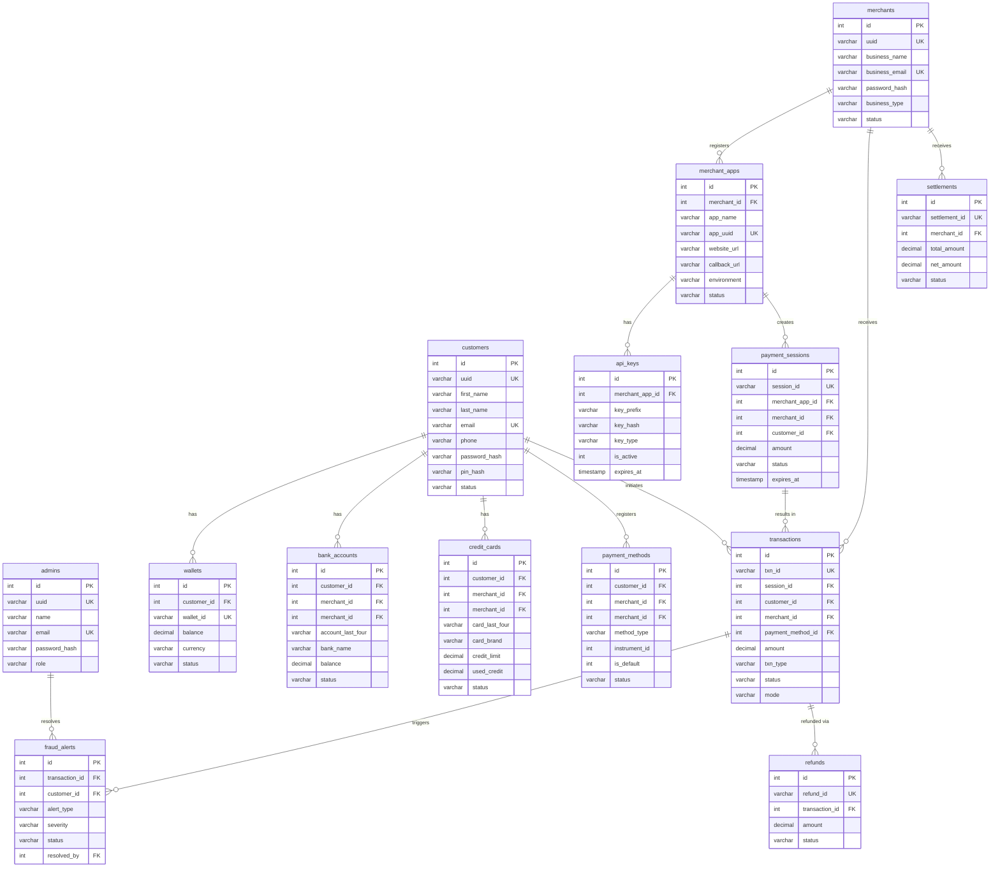

# PaySim — Database Schema Documentation

> **Course:** Database Systems  
> **Database Engine:** Oracle 23ai  
> **ORM:** TypeORM (Node.js)  
> **Total Tables:** 22  

---

## Table of Contents

| # | Table | Purpose |
|---|-------|---------|
| 1 | [admins](#1-admins) | Platform administrator accounts |
| 2 | [customers](#2-customers) | End-user (buyer) accounts |
| 3 | [merchants](#3-merchants) | Business (seller) accounts |
| 4 | [wallets](#4-wallets) | Customer digital wallets |
| 5 | [bank_accounts](#5-bank_accounts) | Linked bank accounts |
| 6 | [credit_cards](#6-credit_cards) | Stored credit/debit cards |
| 7 | [payment_methods](#7-payment_methods) | Unified payment instrument bridge |
| 8 | [merchant_apps](#8-merchant_apps) | Merchant registered applications |
| 9 | [api_keys](#9-api_keys) | API keys for merchant integrations |
| 10 | [api_logs](#10-api_logs) | API request/response audit log |
| 11 | [payment_sessions](#11-payment_sessions) | Checkout session state |
| 12 | [transactions](#12-transactions) | All financial transactions |
| 13 | [payment_attempts](#13-payment_attempts) | Individual payment retry attempts |
| 14 | [refunds](#14-refunds) | Refund requests and state |
| 15 | [settlements](#15-settlements) | Merchant payout settlements |
| 16 | [payment_splits](#16-payment_splits) | Split payment distribution |
| 17 | [escrow_accounts](#17-escrow_accounts) | Escrow holding accounts |
| 18 | [escrow_transactions](#18-escrow_transactions) | Escrow fund movements |
| 19 | [subscription_plans](#19-subscription_plans) | Recurring billing plans |
| 20 | [subscriptions](#20-subscriptions) | Active customer subscriptions |
| 21 | [subscription_payments](#21-subscription_payments) | Recurring billing history |
| 22 | [fraud_alerts](#22-fraud_alerts) | Fraud detection events |
| 23 | [risk_scores](#23-risk_scores) | Per-customer risk assessment |
| 24 | [verification_codes](#24-verification_codes) | OTP / email verification |
| 25 | [notifications](#25-notifications) | In-app notification inbox |
| 26 | [audit_logs](#26-audit_logs) | Security/action audit trail |
| 27 | [sessions](#27-sessions-express-sessions) | Express server sessions |

---

## Entity Relationship Diagram

---

## Table Details

### 1. admins
Stores platform administrator accounts. Admins can view all platform data and manage fraud alerts.

| Column | Type | Constraints | Description |
|--------|------|-------------|-------------|
| `id` | INT | PK, AUTO_INCREMENT | Internal row ID |
| `uuid` | VARCHAR | UNIQUE, NOT NULL | Public-facing admin identifier |
| `name` | VARCHAR | NOT NULL | Full name |
| `email` | VARCHAR | UNIQUE, NOT NULL | Login email |
| `password_hash` | VARCHAR | NOT NULL | bcrypt-hashed password |
| `role` | VARCHAR | DEFAULT `admin` | Admin role classification |
| `created_at` | TIMESTAMP | NOT NULL | Account creation time |
| `updated_at` | TIMESTAMP | NOT NULL | Last update time |

**Relationships:**
- `fraud_alerts` ← one-to-many (admin resolves alerts)

---

### 2. customers
Core user table for all individual buyers/payers on the platform.

| Column | Type | Constraints | Description |
|--------|------|-------------|-------------|
| `id` | INT | PK, AUTO_INCREMENT | Internal row ID |
| `uuid` | VARCHAR | UNIQUE, NOT NULL | Public identifier (shown in UI) |
| `first_name` | VARCHAR | NOT NULL | First name |
| `last_name` | VARCHAR | NOT NULL | Last name |
| `email` | VARCHAR | UNIQUE, NOT NULL | Login / contact email |
| `phone` | VARCHAR | nullable | Mobile number |
| `password_hash` | VARCHAR | NOT NULL | bcrypt-hashed password |
| `pin_hash` | VARCHAR | nullable | 4-digit payment PIN (hashed) |
| `status` | VARCHAR | DEFAULT `active` | `active` / `suspended` |
| `created_at` | TIMESTAMP | NOT NULL | Registration time |
| `updated_at` | TIMESTAMP | NOT NULL | Last profile update |

**Relationships:**
- `wallets` ← one-to-many
- `bank_accounts` ← one-to-many
- `credit_cards` ← one-to-many
- `payment_methods` ← one-to-many
- `transactions` ← one-to-many
- `payment_sessions` ← one-to-many
- `fraud_alerts` ← one-to-many
- `subscriptions` ← one-to-many
- `risk_scores` ← one-to-one

---

### 3. merchants
Business accounts that accept payments through the PaySim gateway.

| Column | Type | Constraints | Description |
|--------|------|-------------|-------------|
| `id` | INT | PK, AUTO_INCREMENT | Internal row ID |
| `uuid` | VARCHAR | UNIQUE, NOT NULL | Public identifier |
| `business_name` | VARCHAR | NOT NULL | Registered business name |
| `business_email` | VARCHAR | UNIQUE, NOT NULL | Login / contact email |
| `phone` | VARCHAR | nullable | Business contact number |
| `password_hash` | VARCHAR | NOT NULL | bcrypt-hashed password |
| `business_type` | VARCHAR | nullable | e.g. `retail`, `saas` |
| `status` | VARCHAR | DEFAULT `active` | `active` / `suspended` |
| `created_at` | TIMESTAMP | NOT NULL | Registration time |
| `updated_at` | TIMESTAMP | NOT NULL | Last update |

**Relationships:**
- `merchant_apps` ← one-to-many
- `transactions` ← one-to-many
- `settlements` ← one-to-many
- `subscriptions` ← one-to-many

---

### 4. wallets
Digital wallet balances for customers. Each customer has exactly one wallet.

| Column | Type | Constraints | Description |
|--------|------|-------------|-------------|
| `id` | INT | PK, AUTO_INCREMENT | Internal row ID |
| `customer_id` | INT | FK → customers, nullable | Payer owner |
| `merchant_id` | INT | FK → merchants, nullable | Business owner |
| `wallet_id` | VARCHAR | UNIQUE, NOT NULL | Public wallet identifier |
| `balance` | DECIMAL | NOT NULL, DEFAULT `0` | Current balance in INR |
| `currency` | VARCHAR | DEFAULT `INR` | Currency code |
| `status` | VARCHAR | DEFAULT `active` | `active` / `frozen` |
| `created_at` | TIMESTAMP | NOT NULL | Creation time |
| `updated_at` | TIMESTAMP | NOT NULL | Last balance update |

---

### 5. bank_accounts
Customer-linked bank accounts for direct debit / UPI payments.

| Column | Type | Constraints | Description |
|--------|------|-------------|-------------|
| `id` | INT | PK, AUTO_INCREMENT | Internal row ID |
| `customer_id` | INT | FK → customers, nullable | Payer owner |
| `merchant_id` | INT | FK → merchants, nullable | Business owner |
| `account_number_hash` | VARCHAR | NOT NULL | SHA-256 hash of account number |
| `account_last_four` | VARCHAR | NOT NULL | Last 4 digits (display only) |
| `bank_name` | VARCHAR | NOT NULL | Bank name |
| `ifsc_code` | VARCHAR | nullable | IFSC routing code |
| `account_holder_name` | VARCHAR | NOT NULL | Name on account |
| `account_type` | VARCHAR | DEFAULT `savings` | `savings` / `current` |
| `balance` | DECIMAL | DEFAULT `0` | Simulated balance |
| `status` | VARCHAR | DEFAULT `active` | Account status |
| `created_at` | TIMESTAMP | NOT NULL | Added date |
| `updated_at` | TIMESTAMP | NOT NULL | Last update |

---

### 6. credit_cards
Saved credit and debit cards. Full card numbers are never stored in plaintext.

| Column | Type | Constraints | Description |
|--------|------|-------------|-------------|
| `id` | INT | PK, AUTO_INCREMENT | Internal row ID |
| `customer_id` | INT | FK → customers, nullable | Payer owner |
| `merchant_id` | INT | FK → merchants, nullable | Business owner |
| `card_number_hash` | VARCHAR | NOT NULL | SHA-256 hash (used for duplicate detection) |
| `card_number_encrypted` | VARCHAR | nullable | AES-256 encrypted (for display of last 4) |
| `card_last_four` | VARCHAR | NOT NULL | Last 4 digits (display) |
| `card_brand` | VARCHAR | NOT NULL | `visa`, `mastercard`, `amex` |
| `cardholder_name` | VARCHAR | NOT NULL | Name on card |
| `expiry_month` | VARCHAR | NOT NULL | MM format |
| `expiry_year` | VARCHAR | NOT NULL | YYYY format |
| `credit_limit` | DECIMAL | DEFAULT `0` | Simulated credit limit |
| `used_credit` | DECIMAL | DEFAULT `0` | Amount utilised |
| `status` | VARCHAR | DEFAULT `active` | `active` / `expired` |
| `created_at` | TIMESTAMP | NOT NULL | Added date |
| `updated_at` | TIMESTAMP | NOT NULL | Last update |

---

### 7. payment_methods
A bridge/union table that maps a customer to any payment instrument (card, bank, wallet) using a polymorphic `instrument_id` + `method_type` pattern.

| Column | Type | Constraints | Description |
|--------|------|-------------|-------------|
| `id` | INT | PK, AUTO_INCREMENT | Internal row ID |
| `customer_id` | INT | FK → customers, nullable | Payer owner |
| `merchant_id` | INT | FK → merchants, nullable | Business owner |
| `method_type` | VARCHAR | NOT NULL | `credit_card`, `bank_account`, `wallet` |
| `instrument_id` | INT | NOT NULL | FK to the appropriate instrument table |
| `is_default` | INT | DEFAULT `0` | 1 = default method |
| `status` | VARCHAR | DEFAULT `active` | Status |
| `created_at` | TIMESTAMP | NOT NULL | Created |
| `updated_at` | TIMESTAMP | NOT NULL | Updated |

**Index:** `IDX_PM_CUSTOMER` on `customer_id`  
**Design Note:** `instrument_id` is a polymorphic foreign key — it references `credit_cards.id`, `bank_accounts.id`, or `wallets.id` depending on `method_type`.

---

### 8. merchant_apps
Applications registered by merchants to use the PaySim payment gateway.

| Column | Type | Constraints | Description |
|--------|------|-------------|-------------|
| `id` | INT | PK, AUTO_INCREMENT | Internal row ID |
| `merchant_id` | INT | FK → merchants, NOT NULL | Owning merchant |
| `app_name` | VARCHAR | NOT NULL | Application name |
| `app_uuid` | VARCHAR | UNIQUE, NOT NULL | Public app identifier |
| `website_url` | VARCHAR | nullable | Store website URL |
| `callback_url` | VARCHAR | NOT NULL | Webhook destination URL |
| `environment` | VARCHAR | DEFAULT `sandbox` | `sandbox` or `production` |
| `status` | VARCHAR | DEFAULT `active` | App status |
| `created_at` | TIMESTAMP | NOT NULL | Registered date |
| `updated_at` | TIMESTAMP | NOT NULL | Last update |

---

### 9. api_keys
API keys associated with merchant apps. Secret keys are stored as raw strings (for simulator simplicity; production systems would hash these).

| Column | Type | Constraints | Description |
|--------|------|-------------|-------------|
| `id` | INT | PK, AUTO_INCREMENT | Internal row ID |
| `merchant_app_id` | INT | FK → merchant_apps, NOT NULL | Parent app |
| `key_prefix` | VARCHAR | NOT NULL | First 8 chars of the key (display) |
| `key_hash` | VARCHAR | NOT NULL | Full key (simulator: plain; prod: hashed) |
| `key_type` | VARCHAR | NOT NULL | `secret` or `publishable` |
| `is_active` | INT | DEFAULT `1` | 1 = active, 0 = revoked |
| `expires_at` | TIMESTAMP | nullable | Optional expiry |
| `last_used_at` | TIMESTAMP | nullable | Last authenticated request |
| `created_at` | TIMESTAMP | NOT NULL | Generated date |

---

### 10. api_logs
Full request/response audit log for every API call authenticated with an API key.

| Column | Type | Constraints | Description |
|--------|------|-------------|-------------|
| `id` | INT | PK, AUTO_INCREMENT | Internal row ID |
| `merchant_app_id` | INT | FK → merchant_apps, nullable | Caller's app |
| `request_id` | VARCHAR | UNIQUE, NOT NULL | UUID for this request |
| `method` | VARCHAR | NOT NULL | HTTP method |
| `endpoint` | VARCHAR | NOT NULL | Endpoint path |
| `status_code` | INT | NOT NULL | HTTP response code |
| `ip_address` | VARCHAR | NOT NULL | Caller IP |
| `request_body` | CLOB | nullable | Full request body |
| `response_body` | CLOB | nullable | Full response body |
| `response_time_ms` | INT | DEFAULT `0` | Latency in ms |
| `created_at` | TIMESTAMP | NOT NULL | Log time |

---

### 11. payment_sessions
A checkout session created before a transaction. Acts as the "shopping cart" for the payment gateway flow.

| Column | Type | Constraints | Description |
|--------|------|-------------|-------------|
| `id` | INT | PK, AUTO_INCREMENT | Internal row ID |
| `session_id` | VARCHAR | UNIQUE, NOT NULL | Public session token (in checkout URL) |
| `merchant_app_id` | INT | FK → merchant_apps, nullable | App that created this session |
| `merchant_id` | INT | FK → merchants, nullable | Owning merchant |
| `customer_id` | INT | FK → customers, nullable | Customer who paid (set on completion) |
| `amount` | DECIMAL | NOT NULL | Amount to collect |
| `currency` | VARCHAR | DEFAULT `INR` | Currency |
| `description` | VARCHAR | nullable | Purpose of payment |
| `status` | VARCHAR | DEFAULT `pending` | `pending`, `completed`, `failed`, `expired` |
| `callback_url` | VARCHAR | nullable | Webhook URL override |
| `metadata` | VARCHAR | nullable | JSON blob for merchant context |
| `expires_at` | TIMESTAMP | NOT NULL | Session expiry time |
| `created_at` | TIMESTAMP | NOT NULL | Created time |
| `updated_at` | TIMESTAMP | NOT NULL | Last update |

---

### 12. transactions
The central financial record table. Every money movement is recorded here.

| Column | Type | Constraints | Description |
|--------|------|-------------|-------------|
| `id` | INT | PK, AUTO_INCREMENT | Internal row ID |
| `txn_id` | VARCHAR | UNIQUE, NOT NULL | Public transaction identifier |
| `session_id` | INT | FK → payment_sessions, nullable | Originating session (for gateway payments) |
| `customer_id` | INT | FK → customers, NOT NULL | Payer |
| `merchant_id` | INT | FK → merchants, nullable | Receiver (merchant) |
| `receiver_id` | INT | nullable | Receiver (P2P: another customer) |
| `receiver_type` | VARCHAR | nullable | `customer` or `merchant` |
| `payment_method_id` | INT | FK → payment_methods, NOT NULL | Payment instrument used |
| `amount` | DECIMAL | NOT NULL | Transaction amount |
| `currency` | VARCHAR | DEFAULT `INR` | Currency |
| `txn_type` | VARCHAR | DEFAULT `payment` | `payment`, `transfer`, `refund`, `topup` |
| `status` | VARCHAR | DEFAULT `initiated` | `initiated`, `success`, `failed` |
| `verified_at` | TIMESTAMP | nullable | When OTP/PIN was verified |
| `mode` | VARCHAR | NOT NULL | `wallet`, `card`, `bank`, `platform`, `upi` |
| `failure_reason` | VARCHAR | nullable | Reason if failed |
| `gateway_ref` | VARCHAR | nullable | External gateway reference |
| `created_at` | TIMESTAMP | NOT NULL | Transaction time |
| `updated_at` | TIMESTAMP | NOT NULL | Last update |

---

### 13. payment_attempts
Records every attempt to pay for a session (including retries on failure).

| Column | Type | Constraints | Description |
|--------|------|-------------|-------------|
| `id` | INT | PK, AUTO_INCREMENT | Internal row ID |
| `session_id` | INT | FK → payment_sessions, nullable | Related session |
| `transaction_id` | INT | FK → transactions, nullable | Resulting transaction |
| `customer_id` | INT | FK → customers, NOT NULL | Attempt customer |
| `payment_method_id` | INT | FK → payment_methods, NOT NULL | Instrument used |
| `amount` | DECIMAL | NOT NULL | Attempted amount |
| `currency` | VARCHAR | DEFAULT `INR` | Currency |
| `status` | VARCHAR | DEFAULT `pending` | Attempt outcome |
| `failure_reason` | VARCHAR | nullable | Why it failed |
| `attempt_sequence` | INT | DEFAULT `1` | Retry count |
| `created_at` | TIMESTAMP | NOT NULL | Attempt time |

---

### 14. refunds
Tracks refund requests associated with completed transactions.

| Column | Type | Constraints | Description |
|--------|------|-------------|-------------|
| `id` | INT | PK, AUTO_INCREMENT | Internal row ID |
| `refund_id` | VARCHAR | UNIQUE, NOT NULL | Public refund ID |
| `transaction_id` | INT | FK → transactions, NOT NULL | Original transaction |
| `amount` | DECIMAL | NOT NULL | Refund amount |
| `currency` | VARCHAR | DEFAULT `INR` | Currency |
| `status` | VARCHAR | DEFAULT `initiated` | `initiated`, `completed`, `failed` |
| `reason` | VARCHAR | nullable | Refund justification |
| `initiated_by` | INT | NOT NULL | ID of the user who requested refund |
| `initiated_by_type` | VARCHAR | NOT NULL | `customer`, `merchant`, `admin` |
| `created_at` | TIMESTAMP | NOT NULL | Request time |
| `updated_at` | TIMESTAMP | NOT NULL | Last update |

---

### 15. settlements
Merchant payouts. Funds collected from customers are held and then settled to merchants on a schedule.

| Column | Type | Constraints | Description |
|--------|------|-------------|-------------|
| `id` | INT | PK, AUTO_INCREMENT | Internal row ID |
| `settlement_id` | VARCHAR | UNIQUE, NOT NULL | Public settlement reference |
| `merchant_id` | INT | FK → merchants, NOT NULL | Beneficiary merchant |
| `total_amount` | DECIMAL | NOT NULL | Gross amount collected |
| `fee_amount` | DECIMAL | DEFAULT `0` | Platform fee deducted |
| `net_amount` | DECIMAL | NOT NULL | Amount disbursed to merchant |
| `currency` | VARCHAR | DEFAULT `INR` | Currency |
| `status` | VARCHAR | DEFAULT `pending` | `pending`, `processing`, `completed`, `failed` |
| `settlement_date` | TIMESTAMP | NOT NULL | Date of settlement |
| `created_at` | TIMESTAMP | NOT NULL | Created time |
| `updated_at` | TIMESTAMP | NOT NULL | Last update |

---

### 16. payment_splits
When a transaction is split among multiple merchants (e.g., marketplace split).

| Column | Type | Constraints | Description |
|--------|------|-------------|-------------|
| `id` | INT | PK, AUTO_INCREMENT | Internal row ID |
| `transaction_id` | INT | FK → transactions, NOT NULL | Parent transaction |
| `merchant_id` | INT | FK → merchants, NOT NULL | Split beneficiary |
| `amount` | DECIMAL | NOT NULL | Split amount |
| `currency` | VARCHAR | DEFAULT `INR` | Currency |
| `created_at` | TIMESTAMP | NOT NULL | Created time |

---

### 17. escrow_accounts
Holds funds temporarily on behalf of a merchant or customer (for marketplace / dispute flows).

| Column | Type | Constraints | Description |
|--------|------|-------------|-------------|
| `id` | INT | PK, AUTO_INCREMENT | Internal row ID |
| `merchant_id` | INT | FK → merchants, UNIQUE, nullable | Merchant-linked escrow |
| `customer_id` | INT | FK → customers, UNIQUE, nullable | Customer-linked escrow |
| `balance` | DECIMAL | DEFAULT `0` | Held balance |
| `currency` | VARCHAR | DEFAULT `INR` | Currency |
| `status` | VARCHAR | DEFAULT `active` | Account status |
| `created_at` | TIMESTAMP | NOT NULL | Created |
| `updated_at` | TIMESTAMP | NOT NULL | Updated |

---

### 18. escrow_transactions
Individual fund movements in/out of escrow accounts.

| Column | Type | Constraints | Description |
|--------|------|-------------|-------------|
| `id` | INT | PK, AUTO_INCREMENT | Internal row ID |
| `escrow_account_id` | INT | FK → escrow_accounts, NOT NULL | Parent account |
| `transaction_id` | INT | FK → transactions, UNIQUE | Associated transaction |
| `amount` | DECIMAL | NOT NULL | Amount moved |
| `status` | VARCHAR | DEFAULT `held` | `held`, `released`, `reversed` |
| `release_date` | TIMESTAMP | nullable | Scheduled release |
| `created_at` | TIMESTAMP | NOT NULL | Created |
| `updated_at` | TIMESTAMP | NOT NULL | Updated |

---

### 19. subscription_plans
Recurring billing plans defined by merchants.

| Column | Type | Constraints | Description |
|--------|------|-------------|-------------|
| `id` | INT | PK, AUTO_INCREMENT | Internal row ID |
| `merchant_id` | INT | FK → merchants, NOT NULL | Plan creator |
| `name` | VARCHAR | NOT NULL | Plan name (e.g., "Pro Monthly") |
| `description` | VARCHAR | nullable | Plan details |
| `amount` | DECIMAL | NOT NULL | Recurring charge amount |
| `currency` | VARCHAR | DEFAULT `INR` | Currency |
| `billing_interval` | VARCHAR | NOT NULL | `monthly`, `yearly`, `weekly` |
| `status` | VARCHAR | DEFAULT `active` | Plan status |
| `created_at` | TIMESTAMP | NOT NULL | Created |

---

### 20. subscriptions
Tracks a customer's active subscription to a merchant plan.

| Column | Type | Constraints | Description |
|--------|------|-------------|-------------|
| `id` | INT | PK, AUTO_INCREMENT | Internal row ID |
| `subscription_id` | VARCHAR | UNIQUE, NOT NULL | Public subscription reference |
| `customer_id` | INT | FK → customers, NOT NULL | Subscriber |
| `merchant_id` | INT | FK → merchants, NOT NULL | Plan provider |
| `plan_id` | INT | FK → subscription_plans, NOT NULL | Chosen plan |
| `status` | VARCHAR | DEFAULT `active` | `active`, `cancelled`, `past_due` |
| `next_billing_date` | TIMESTAMP | NOT NULL | Next charge date |
| `payment_method_id` | INT | FK → payment_methods | Card/method for auto-debit |
| `created_at` | TIMESTAMP | NOT NULL | Subscribed date |
| `updated_at` | TIMESTAMP | NOT NULL | Last update |

---

### 21. subscription_payments
Log of every billing cycle charge for a subscription.

| Column | Type | Constraints | Description |
|--------|------|-------------|-------------|
| `id` | INT | PK, AUTO_INCREMENT | Internal row ID |
| `subscription_id` | INT | FK → subscriptions, NOT NULL | Parent subscription |
| `transaction_id` | INT | FK → transactions, UNIQUE | Resulting transaction |
| `billing_date` | TIMESTAMP | NOT NULL | Billing cycle date |
| `status` | VARCHAR | DEFAULT `pending` | `pending`, `paid`, `failed` |
| `created_at` | TIMESTAMP | NOT NULL | Created |

---

### 22. fraud_alerts
Events generated by the fraud detection engine when suspicious activity is detected.

| Column | Type | Constraints | Description |
|--------|------|-------------|-------------|
| `id` | INT | PK, AUTO_INCREMENT | Internal row ID |
| `transaction_id` | INT | FK → transactions, nullable | Triggering transaction |
| `customer_id` | INT | FK → customers, nullable | Flagged customer |
| `alert_type` | VARCHAR | NOT NULL | e.g. `amount_spike`, `velocity_check`, `card_testing` |
| `severity` | VARCHAR | DEFAULT `medium` | `low`, `medium`, `high`, `critical` |
| `description` | VARCHAR | NOT NULL | Human-readable description |
| `status` | VARCHAR | DEFAULT `open` | `open`, `investigating`, `resolved`, `false_positive` |
| `resolved_by` | INT | FK → admins, nullable | Admin who resolved |
| `resolved_at` | TIMESTAMP | nullable | Resolution time |
| `created_at` | TIMESTAMP | NOT NULL | Alert raised time |

---

### 23. risk_scores
Continuously calculated risk profile per customer. Updated by the fraud service after each transaction.

| Column | Type | Constraints | Description |
|--------|------|-------------|-------------|
| `id` | INT | PK, AUTO_INCREMENT | Internal row ID |
| `customer_id` | INT | FK → customers, UNIQUE | One score per customer |
| `risk_score` | INT | DEFAULT `0` | Score 0–100 (higher = riskier) |
| `risk_level` | VARCHAR | DEFAULT `low` | `low`, `medium`, `high`, `critical` |
| `factors` | VARCHAR | nullable | JSON array of contributing factors |
| `last_evaluated` | TIMESTAMP | NOT NULL | Last recalculation |
| `created_at` | TIMESTAMP | NOT NULL | First created |
| `updated_at` | TIMESTAMP | NOT NULL | Last updated |

---

### 24. verification_codes
Stores OTPs for login, registration, and password reset verification.

| Column | Type | Constraints | Description |
|--------|------|-------------|-------------|
| `id` | INT | PK, AUTO_INCREMENT | Internal row ID |
| `email` | VARCHAR | NOT NULL | Target email |
| `code` | VARCHAR | NOT NULL | 6-digit OTP |
| `type` | VARCHAR | NOT NULL | `login`, `register`, `password_reset` |
| `expires_at` | TIMESTAMP | NOT NULL | OTP expiry (typically 10 minutes) |
| `created_at` | TIMESTAMP | NOT NULL | Generated time |

**Security Note:** OTPs are single-use and server-invalidated after successful verification.

---

### 25. notifications
In-app notification messages shown to customers, merchants, or admins.

| Column | Type | Constraints | Description |
|--------|------|-------------|-------------|
| `id` | INT | PK, AUTO_INCREMENT | Internal row ID |
| `user_id` | INT | NOT NULL | Target user ID |
| `user_type` | VARCHAR | NOT NULL | `customer`, `merchant`, `admin` |
| `title` | VARCHAR | NOT NULL | Notification heading |
| `message` | VARCHAR | NOT NULL | Notification body |
| `type` | VARCHAR | DEFAULT `info` | `info`, `success`, `warning`, `danger` |
| `is_read` | INT | DEFAULT `0` | 0 = unread, 1 = read |
| `created_at` | TIMESTAMP | NOT NULL | Sent at |

---

### 26. audit_logs
Security audit trail for significant user actions (login, password change, etc.).

| Column | Type | Constraints | Description |
|--------|------|-------------|-------------|
| `id` | INT | PK, AUTO_INCREMENT | Internal row ID |
| `customer_id` | INT | FK → customers, NOT NULL | Actor |
| `action` | VARCHAR | NOT NULL | e.g. `PASSWORD_CHANGED`, `LOGIN_SUCCESS` |
| `details` | VARCHAR | nullable | Additional context |
| `ip_address` | VARCHAR | nullable | Actor's IP |
| `created_at` | TIMESTAMP | NOT NULL | Action time |

---

### 27. sessions (Express Sessions)
Server-side session storage for Express.js authentication sessions.

| Column | Type | Constraints | Description |
|--------|------|-------------|-------------|
| `id` | VARCHAR(255) | PK | Session ID |
| `expiredAt` | INT | NOT NULL | Unix timestamp of expiry |
| `data` | CLOB | NOT NULL | Session JSON data |

---

## Key Design Patterns

### Security
- **Passwords**: bcrypt hashed with salt rounds ≥ 10
- **Payment PINs**: bcrypt hashed separately (`pin_hash`)
- **Card Numbers**: SHA-256 hashed for uniqueness checks + AES-256 encrypted for retrieval
- **Bank Accounts**: SHA-256 hashed only (displayed as last 4 digits)
- **API Keys**: Stored in plaintext for simulator purposes (production should hash with SHA-256)
- **OTPs**: Stored as plaintext short-lived codes with strict expiry

### Polymorphism
- **`payment_methods`** uses a polymorphic `instrument_id` + `method_type` pattern to unify cards, bank accounts, and wallets under one table.
- **`transactions`** uses `receiver_id` + `receiver_type` for P2P vs merchant payments.

### Soft Deletes
- No hard deletes are used; all entities use a `status` column (`active`, `suspended`, `expired`) to mark deactivated records.

### Auditing
- All critical tables include `created_at` and `updated_at` fields.
- The `audit_logs` table provides a detailed security trail.
- The `api_logs` table logs every external API interaction.
