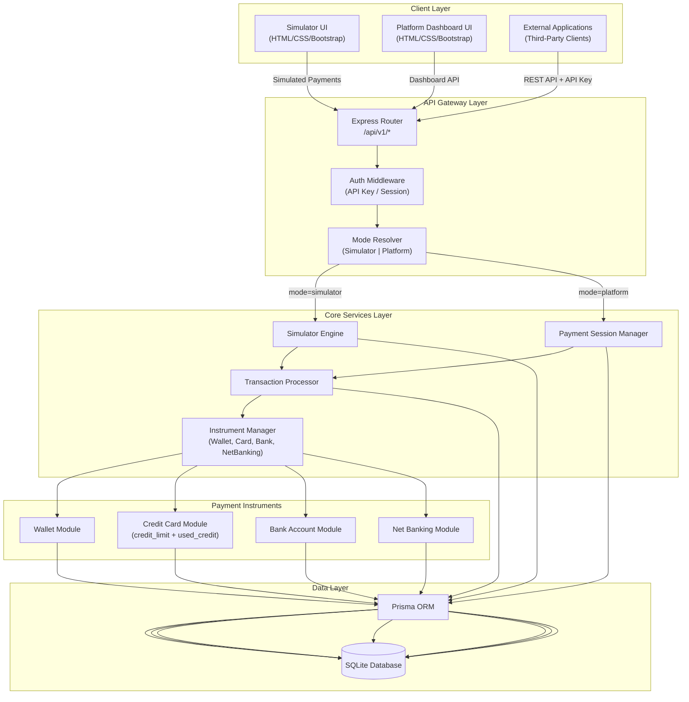
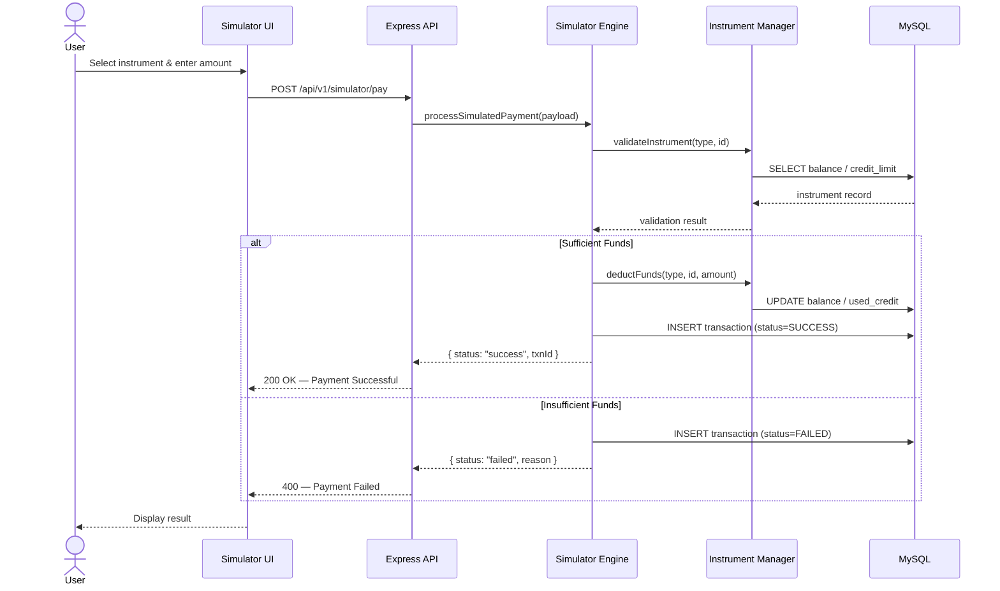
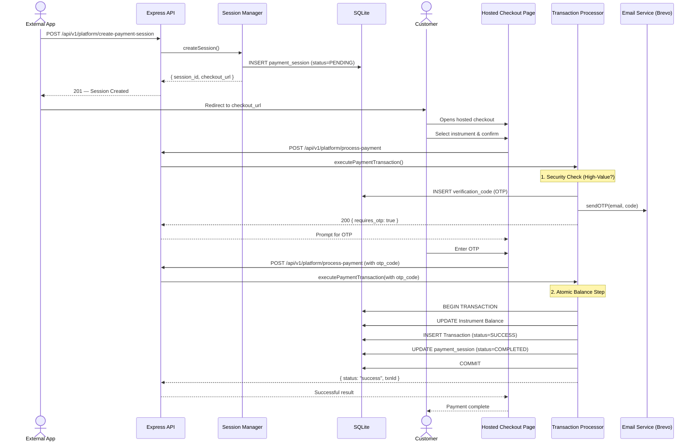
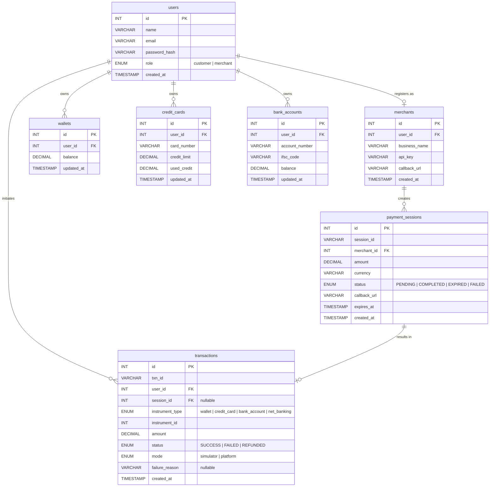
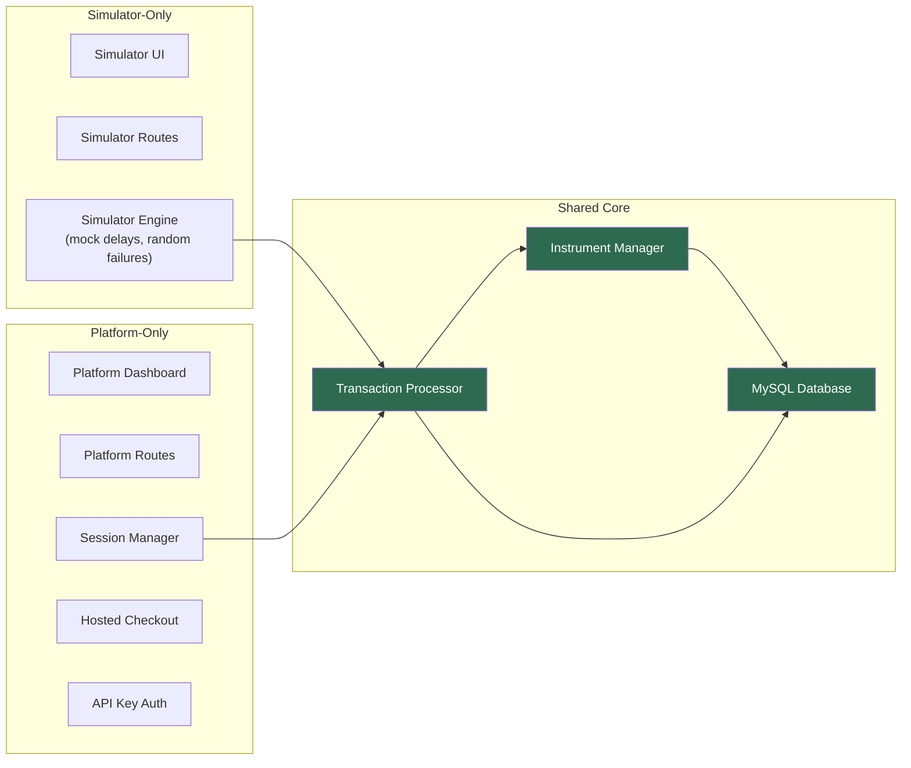

# Payment Gateway Platform with Integrated Payment Simulator — System Architecture

## 1. High-Level Architecture Diagram



---

## 2. Module Breakdown

### 2.1 Directory Structure

```
project/
├── server.js                    # Entry point
├── package.json
├── .env                         # Environment config
├── config/
│   └── db.js                    # MySQL connection pool
├── middleware/
│   ├── auth.js                  # API key & session auth
│   └── modeResolver.js          # Simulator vs Platform routing
├── routes/
│   ├── simulator.routes.js      # Simulator-mode endpoints
│   ├── platform.routes.js       # Platform-mode endpoints (sessions, checkout)
│   ├── payment.routes.js        # Shared payment processing
│   ├── instrument.routes.js     # Manage wallets, cards, accounts
│   └── dashboard.routes.js      # Dashboard / analytics
├── controllers/
│   ├── simulator.controller.js
│   ├── platform.controller.js
│   ├── payment.controller.js
│   ├── instrument.controller.js
│   └── dashboard.controller.js
├── services/
│   ├── simulator.service.js     # Simulation logic & mock responses
│   ├── session.service.js       # Payment session lifecycle
│   ├── transaction.service.js   # Core transaction orchestration
│   └── instrument.service.js    # Balance, credit limit checks
├── models/
│   ├── User.js
│   ├── Merchant.js
│   ├── Wallet.js
│   ├── CreditCard.js
│   ├── BankAccount.js
│   ├── PaymentSession.js
│   └── Transaction.js
├── db/
│   └── schema.sql               # DDL for all tables
├── public/                      # Frontend (HTML/CSS/Bootstrap)
│   ├── index.html               # Landing page
│   ├── simulator/
│   │   ├── index.html           # Simulator dashboard
│   │   ├── pay.html             # Make a payment
│   │   └── history.html         # Transaction history
│   ├── platform/
│   │   ├── dashboard.html       # Merchant dashboard
│   │   ├── sessions.html        # View payment sessions
│   │   └── integrate.html       # API keys & docs
│   ├── checkout/
│   │   └── index.html           # Hosted checkout page
│   ├── css/
│   │   └── styles.css
│   └── js/
│       ├── simulator.js
│       ├── platform.js
│       └── checkout.js
└── utils/
    ├── idGenerator.js           # UUID / txn-ID generation
    ├── validators.js            # Input validation
    └── responseHelper.js        # Standardised API responses
```

### 2.2 Module Summary Table

| Module | Purpose |
|---|---|
| **Config** | Prisma client singleton, environment variables |
| **Middleware** | JWT Authentication, API key validation, 2FA/OTP enforcement |
| **Routes** | Express route definitions grouped by domain |
| **Controllers** | Request handling and data transformation |
| **Services** | CORE business logic (Transactions, Sessions, Email, Fraud, Risk) |
| **Prisma** | Database modelling and automated SQL generation for SQLite |
| **Public** | Modern HTML/CSS/JS frontend with Bootstrap 5 |
| **Utils** | Shared helper functions (validations, responses, logging) |

---

## 3. Payment Workflow

### 3.1 Simulator Mode Flow



**Instrument-Specific Rules:**

| Instrument | Validation Rule |
|---|---|
| **Wallet** | `balance >= amount` → deduct from `balance` |
| **Credit Card** | `(credit_limit - used_credit) >= amount` → increase `used_credit` |
| **Bank Account** | `balance >= amount` → deduct from `balance` |
| **Net Banking** | Linked bank account check → same rules as Bank Account |

### 3.2 Platform Mode Flow (with OTP Security)



---

## 4. Component Responsibilities

### 4.1 Backend Components

| Component | Responsibilities |
|---|---|
| **server.js** | Bootstrap Express, register middleware, mount routes, start listening |
| **Prisma** | Type-safe database access for SQLite; handles migrations and seeding |
| **Auth Middleware** | JWT & API Key validation; user session management |
| **Email Service** (`services/email.service.js`) | Handles all transactional emails (Registration, 2FA, Payment OTP) via Brevo |
| **Transaction Processor** (`services/transaction.service.js`) | **Smart Routing**: Retries failed attempts; **Security**: Enforces OTP for high-value transctions |
| **Session Manager** (`services/session.service.js`) | Orchestrates the payment checkout lifecycle |
| **Fraud Service** (`services/fraud.service.js`) | Real-time velocity and amount spike detection |

### 4.2 Frontend Components

| Page | Responsibilities |
|---|---|
| **Simulator Dashboard** | List user instruments, initiate payments, view history |
| **Platform Dashboard** | Merchant view: API keys, session list, analytics |
| **Hosted Checkout** | Customer-facing payment form generated per session; selects instrument and confirms payment |

### 4.3 Database Schema (ER Diagram)



---

## 5. Simulator ↔ Platform Mode Interaction

### 5.1 Shared vs. Separate Concerns



### 5.2 Mode Comparison Matrix

| Aspect | Simulator Mode | Platform Mode | Shared? |
|---|---|---|---|
| **Entry Point** | Simulator UI → `/api/v1/simulator/*` | External App → `/api/v1/platform/*` | ✗ |
| **Authentication** | Session/cookie-based user login | API key header (`x-api-key`) | ✗ |
| **Payment Initiation** | User picks instrument + amount directly | Merchant creates session → customer uses checkout | ✗ |
| **Transaction Processing** | `transaction.service.js` | `transaction.service.js` | ✓ |
| **Instrument Validation** | `instrument.service.js` | `instrument.service.js` | ✓ |
| **Fund Deduction** | `instrument.service.js` | `instrument.service.js` | ✓ |
| **Transaction Table** | Same `transactions` table (`mode = 'simulator'`) | Same `transactions` table (`mode = 'platform'`) | ✓ |
| **Sessions** | Not used | Required (payment_sessions table) | ✗ |
| **Result Delivery** | Direct JSON response to UI | Callback redirect to external app | ✗ |

### 5.3 Mode Determination Logic

```
Request arrives at Express Router
    │
    ├── /api/v1/simulator/*  →  mode = "simulator"
    │       Auth: session cookie
    │       Flow: Direct instrument → pay
    │
    └── /api/v1/platform/*   →  mode = "platform"
            Auth: API key
            Flow: Session → Checkout → Pay → Callback
```

Both modes converge at the **Transaction Processor**, which:
1. Validates the payment instrument
2. Checks sufficient balance / credit
3. Executes the debit atomically (MySQL transaction)
4. Records the result in the `transactions` table with `mode` flag

> **Note:** The `mode` column in the `transactions` table is critical — it allows unified analytics and reporting while keeping the audit trail clear for each mode.

---

## 6. Key API Endpoints

| Method | Endpoint | Mode | Description |
|---|---|---|---|
| `POST` | `/api/v1/simulator/pay` | Simulator | Process a simulated payment |
| `GET` | `/api/v1/simulator/history` | Simulator | List transaction history |
| `GET` | `/api/v1/simulator/instruments` | Simulator | List user's instruments |
| `POST` | `/api/v1/platform/sessions` | Platform | Create a payment session |
| `GET` | `/api/v1/platform/sessions/:id` | Platform | Get session details |
| `POST` | `/api/v1/platform/sessions/:id/pay` | Platform | Process payment on a session |
| `GET` | `/api/v1/platform/dashboard` | Platform | Merchant analytics |
| `POST` | `/api/v1/auth/register` | Both | Register user/merchant |
| `POST` | `/api/v1/auth/login` | Both | Login |
| `POST` | `/api/v1/instruments/wallet` | Both | Create/top-up wallet |
| `POST` | `/api/v1/instruments/card` | Both | Add credit card |
| `POST` | `/api/v1/instruments/bank` | Both | Add bank account |
