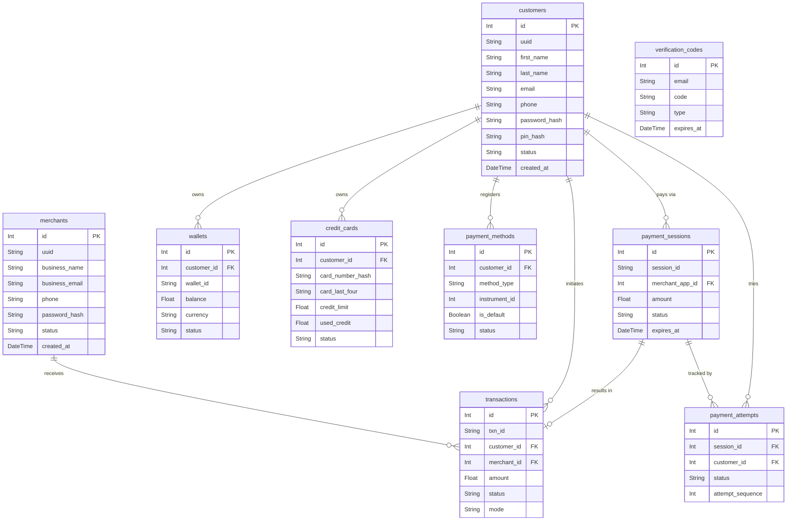

# Payment Gateway Platform — Database Schema Design

This project uses **SQLite** for data storage, managed through the **Prisma ORM**. The schema is designed for high consistency and auditability, following 3NF normalization principles where appropriate.

---

## 1. ER Diagram



---

## 2. Entity Relationships

### 2.1 Relationship Summary Table

| Parent Entity | Child Entity | Relationship | FK Column | Description |
|---|---|---|---|---|
| `customers` | `wallets` | One-to-Many | `customer_id` | A customer can have multiple wallets |
| `customers` | `credit_cards` | One-to-Many | `customer_id` | A customer can own multiple credit cards |
| `customers` | `bank_accounts` | One-to-Many | `customer_id` | A customer can link multiple bank accounts |
| `customers` | `payment_methods` | One-to-Many | `customer_id` | A customer registers payment methods |
| `customers` | `transactions` | One-to-Many | `customer_id` | A customer initiates multiple transactions |
| `customers` | `payment_sessions` | One-to-Many (optional) | `customer_id` | A customer may be associated with sessions |
| `merchants` | `merchant_apps` | One-to-Many | `merchant_id` | A merchant can create multiple applications |
| `merchants` | `transactions` | One-to-Many | `merchant_id` | A merchant receives many payments |
| `merchants` | `settlements` | One-to-Many | `merchant_id` | A merchant has periodic settlements |
| `merchant_apps` | `api_keys` | One-to-Many | `merchant_app_id` | Each app can have multiple API keys |
| `merchant_apps` | `payment_sessions` | One-to-Many | `merchant_app_id` | Each app creates payment sessions |
| `merchant_apps` | `api_logs` | One-to-Many | `merchant_app_id` | API calls are logged per app |
| `payment_sessions` | `transactions` | One-to-One (optional) | `session_id` | A session results in at most one transaction |
| `transactions` | `refunds` | One-to-Many | `transaction_id` | A transaction can have partial/multiple refunds |
| `transactions` | `fraud_alerts` | One-to-Many | `transaction_id` | A transaction may trigger fraud alerts |
| `admins` | `fraud_alerts` | One-to-Many | `resolved_by` | An admin resolves fraud alerts |
| `payment_methods` | `transactions` | One-to-Many | `payment_method_id` | Transactions use a specific payment method |

### 2.2 Relationship Diagram (Simplified)

```
customers ──┬── wallets
             ├── credit_cards
             ├── bank_accounts
             ├── payment_methods ──── transactions
             └── payment_sessions ──┘       │
                       ▲                    ├── refunds
                       │                    └── fraud_alerts ── admins
                  merchant_apps                     ▲
                       │                            │
                  ├── api_keys              settlements
                  └── api_logs                  │
                       ▲                   merchants
                       │
                  merchants
```

---

## 3. Normalization Explanation

### 3.1 First Normal Form (1NF)

> **Rule:** All columns contain atomic (indivisible) values; no repeating groups or arrays.

| Aspect | How Our Schema Satisfies 1NF |
|---|---|
| **Atomic values** | Every column stores a single value — e.g., `first_name` and `last_name` are separate columns in `customers`. |
| **No repeating groups** | Multiple wallets are stored as separate rows in the `wallets` table. |
| **Unique rows** | Every table has an auto-increment `Int id` as a primary key. |
| **Type Safety** | Prisma ensures data types (DateTime, Float, Int) are strictly enforced at the application level. |

### 3.2 Second Normal Form (2NF)

> **Rule:** Must be in 1NF, and every non-key column must depend on the **entire** primary key (no partial dependencies).

| Aspect | How Our Schema Satisfies 2NF |
|---|---|
| **Single-column PKs** | All tables use a single `id` column as PK — partial dependency is impossible with a single-column key |
| **Instrument separation** | `wallets`, `credit_cards`, and `bank_accounts` are separate tables; each non-key attribute depends solely on that table's `id` |
| **`payment_methods` abstraction** | Instead of embedding instrument details in `transactions`, we use a `payment_methods` bridge table — `transaction.payment_method_id` refers to one row, and all instrument-specific data lives in the respective instrument table |

### 3.3 Third Normal Form (3NF)

> **Rule:** Must be in 2NF, and no non-key column depends on another non-key column (no transitive dependencies).

| Potential Violation | How We Resolved It |
|---|---|
| **Merchant info in transactions** | `transactions` stores only `merchant_id` (FK), not `business_name`. Merchant details are retrieved via JOIN — no transitive dependency |
| **API key ↔ merchant** | `api_keys` references `merchant_app_id`, not `merchant_id` directly. The merchant is resolved through `merchant_apps` → `merchants` — each fact is stored once |
| **Settlement amounts** | `net_amount` = `total_amount - fee_amount` appears derivable, but we store it explicitly because fee structures can change after recording — this is an accepted **denormalization for auditability** |
| **Card brand in `credit_cards`** | `card_brand` (Visa, Mastercard) could theoretically be derived from BIN ranges, but we store it for performance — minor accepted denormalization |
| **Refund `initiated_by_type`** | We use a type discriminator (`initiated_by_type`) + generic FK (`initiated_by`) to reference `customers`, `merchants`, or `admins` — this avoids three separate nullable FK columns while maintaining referential clarity |

### 3.4 Summary

```
Raw Data → 1NF (Atomic values, unique rows, no repeating groups)
         → 2NF (No partial dependencies — all single-column PKs)
         → 3NF (No transitive dependencies — FKs replace embedded info)
```

All 14 tables satisfy **3NF**, with two minor, intentional denormalizations (`net_amount` in `settlements` and `card_brand` in `credit_cards`) documented for auditability and performance.

---

---

## 4. Complete Prisma Schema

The full definition of our database structure is maintained in [prisma/schema.prisma](file:///Users/param/Desktop/PARAM/Sixth%20Sem/CSE401%20-%20DBMS/Project/prisma/schema.prisma). 

### Major Models Added Recently:

| Model | Purpose |
|---|---|
| `verification_codes` | Secure storage for login 2FA and High-Value payment OTPs. |
| `payment_attempts` | Detailed tracking of every attempt made during a "Smart Routing" cycle. |
| `risk_scores` | Dynamic assessment of customer risk based on transaction history and alerts. |

CREATE DATABASE IF NOT EXISTS payment_gateway
    CHARACTER SET utf8mb4
    COLLATE utf8mb4_unicode_ci;

USE payment_gateway;

-- ============================================================
-- 1. CUSTOMERS
-- ============================================================
CREATE TABLE customers (
    id              INT AUTO_INCREMENT PRIMARY KEY,
    uuid            VARCHAR(36)     NOT NULL,
    first_name      VARCHAR(100)    NOT NULL,
    last_name       VARCHAR(100)    NOT NULL,
    email           VARCHAR(255)    NOT NULL,
    phone           VARCHAR(20)     DEFAULT NULL,
    password_hash   VARCHAR(255)    NOT NULL,
    status          ENUM('active', 'suspended', 'deleted')
                        NOT NULL DEFAULT 'active',
    created_at      TIMESTAMP       NOT NULL DEFAULT CURRENT_TIMESTAMP,
    updated_at      TIMESTAMP       NOT NULL DEFAULT CURRENT_TIMESTAMP
                        ON UPDATE CURRENT_TIMESTAMP,

    UNIQUE KEY  uq_customers_uuid   (uuid),
    UNIQUE KEY  uq_customers_email  (email),
    INDEX       idx_customers_phone (phone),
    INDEX       idx_customers_status(status)
) ENGINE=InnoDB;

-- ============================================================
-- 2. MERCHANTS
-- ============================================================
CREATE TABLE merchants (
    id              INT AUTO_INCREMENT PRIMARY KEY,
    uuid            VARCHAR(36)     NOT NULL,
    business_name   VARCHAR(255)    NOT NULL,
    business_email  VARCHAR(255)    NOT NULL,
    phone           VARCHAR(20)     DEFAULT NULL,
    password_hash   VARCHAR(255)    NOT NULL,
    business_type   VARCHAR(100)    DEFAULT NULL,
    status          ENUM('active', 'suspended', 'deleted')
                        NOT NULL DEFAULT 'active',
    created_at      TIMESTAMP       NOT NULL DEFAULT CURRENT_TIMESTAMP,
    updated_at      TIMESTAMP       NOT NULL DEFAULT CURRENT_TIMESTAMP
                        ON UPDATE CURRENT_TIMESTAMP,

    UNIQUE KEY  uq_merchants_uuid           (uuid),
    UNIQUE KEY  uq_merchants_business_email (business_email),
    INDEX       idx_merchants_status        (status)
) ENGINE=InnoDB;

-- ============================================================
-- 3. ADMINS
-- ============================================================
CREATE TABLE admins (
    id              INT AUTO_INCREMENT PRIMARY KEY,
    uuid            VARCHAR(36)     NOT NULL,
    name            VARCHAR(200)    NOT NULL,
    email           VARCHAR(255)    NOT NULL,
    password_hash   VARCHAR(255)    NOT NULL,
    role            ENUM('super_admin', 'admin', 'support')
                        NOT NULL DEFAULT 'admin',
    created_at      TIMESTAMP       NOT NULL DEFAULT CURRENT_TIMESTAMP,
    updated_at      TIMESTAMP       NOT NULL DEFAULT CURRENT_TIMESTAMP
                        ON UPDATE CURRENT_TIMESTAMP,

    UNIQUE KEY  uq_admins_uuid  (uuid),
    UNIQUE KEY  uq_admins_email (email),
    INDEX       idx_admins_role (role)
) ENGINE=InnoDB;

-- ============================================================
-- 4. WALLETS
-- ============================================================
CREATE TABLE wallets (
    id              INT AUTO_INCREMENT PRIMARY KEY,
    customer_id     INT             NOT NULL,
    wallet_id       VARCHAR(36)     NOT NULL,
    balance         DECIMAL(15, 2)  NOT NULL DEFAULT 0.00,
    currency        VARCHAR(3)      NOT NULL DEFAULT 'INR',
    status          ENUM('active', 'frozen', 'closed')
                        NOT NULL DEFAULT 'active',
    created_at      TIMESTAMP       NOT NULL DEFAULT CURRENT_TIMESTAMP,
    updated_at      TIMESTAMP       NOT NULL DEFAULT CURRENT_TIMESTAMP
                        ON UPDATE CURRENT_TIMESTAMP,

    UNIQUE KEY  uq_wallets_wallet_id    (wallet_id),
    INDEX       idx_wallets_customer    (customer_id),
    INDEX       idx_wallets_status      (status),

    CONSTRAINT  fk_wallets_customer
        FOREIGN KEY (customer_id) REFERENCES customers (id)
        ON UPDATE CASCADE ON DELETE RESTRICT
) ENGINE=InnoDB;

-- ============================================================
-- 5. CREDIT CARDS
-- ============================================================
CREATE TABLE credit_cards (
    id                  INT AUTO_INCREMENT PRIMARY KEY,
    customer_id         INT             NOT NULL,
    card_number_hash    VARCHAR(255)    NOT NULL,
    card_last_four      CHAR(4)         NOT NULL,
    card_brand          ENUM('visa', 'mastercard', 'amex', 'rupay', 'discover')
                            NOT NULL,
    cardholder_name     VARCHAR(255)    NOT NULL,
    expiry_month        CHAR(2)         NOT NULL,
    expiry_year         CHAR(4)         NOT NULL,
    credit_limit        DECIMAL(15, 2)  NOT NULL DEFAULT 0.00,
    used_credit         DECIMAL(15, 2)  NOT NULL DEFAULT 0.00,
    status              ENUM('active', 'expired', 'blocked')
                            NOT NULL DEFAULT 'active',
    created_at          TIMESTAMP       NOT NULL DEFAULT CURRENT_TIMESTAMP,
    updated_at          TIMESTAMP       NOT NULL DEFAULT CURRENT_TIMESTAMP
                            ON UPDATE CURRENT_TIMESTAMP,

    INDEX       idx_cc_customer         (customer_id),
    INDEX       idx_cc_last_four        (card_last_four),
    INDEX       idx_cc_status           (status),

    CONSTRAINT  fk_cc_customer
        FOREIGN KEY (customer_id) REFERENCES customers (id)
### Database Engine: SQLite
SQLite provides a self-contained, serverless database engine perfect for local development and simulation. While it doesn't support all complex MySQL features (like native ENUMs or JSON functions), we use **Prisma** to simulate these through string validation and application-level logic.

---

## 5. Index Strategy Summary

Prisma automatically generates indexes for `@@index` and `@@unique` directives in `schema.prisma`.

| Table | Index | Purpose |
|---|---|---|
| `customers` | `uq_customers_email` | Fast login lookups and 2FA email verification. |
| `transactions` | `idx_txn_created` | Rapid retrieval for dashboard "Spending Trends" (last 7 days). |
| `transactions` | `idx_txn_mode` | Separation of Platform vs. Simulator history for analytics. |
| `verification_codes` | `idx_vc_email_code` | Performance index for OTP validation flows. |
| `payment_sessions` | `idx_ps_expires` | Optimized cleanup of expired payment sessions. |

---

## 6. Design Decisions

| Decision | Rationale |
|---|---|
| **Separation of Entities** | Role-specific data (Customer vs Merchant) diverges significantly; keeps the schema clean and performant. |
| **`payment_methods` abstraction** | Provides a unified interface for polymorphic instruments (Wallets, Cards, Bank Accounts). |
| **Bcrypt Hashing** | Industry-standard security for passwords and PINs; raw secrets are never stored. |
| **Transactional OTPs** | OTP generation is handled outside balance transactions to ensure persistence even on payment failure. |
| **Smart Routing Tracking** | The `payment_attempts` table allows auditing of the autonomous retry logic during payment processing. |
