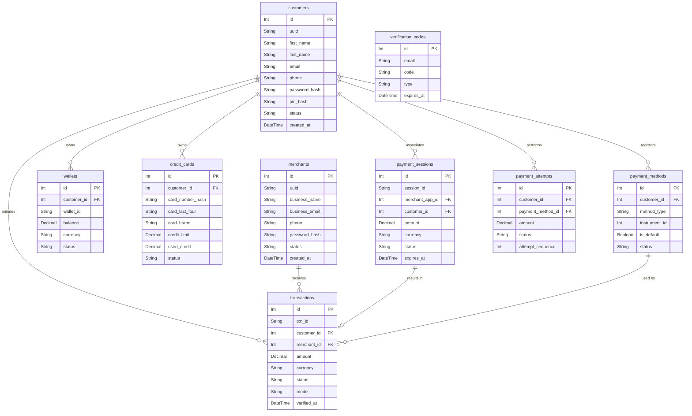

# Payment Gateway Platform — Database Schema Design

This project uses **Oracle Database** for data storage, managed through **TypeORM**. The schema is designed for high consistency, auditability, and horizontal scalability, following 3NF normalization principles.

---

## 1. ER Diagram



---

## 2. Entity Relationships

### 2.1 Relationship Summary Table

| Parent Entity | Child Entity | Relationship | FK Column | Description |
|---|---|---|---|---|
| `customers` | `wallets` | One-to-Many | `customer_id` | A customer can have multiple wallets |
| `customers` | `credit_cards` | One-to-Many | `customer_id` | A customer can own multiple credit cards |
| `customers` | `bank_accounts` | One-to-Many | `customer_id` | A customer can link multiple bank accounts |
| `customers` | `payment_methods` | One-to-Many | `customer_id` | A customer registers payment methods |
| `customers` | `transactions` | One-to-Many | `customer_id` | A customer initiates multiple transactions |
| `customers` | `payment_sessions` | One-to-Many (optional) | `customer_id` | A customer may be associated with sessions |
| `merchants` | `merchant_apps` | One-to-Many | `merchant_id` | A merchant can create multiple applications |
| `merchants` | `transactions` | One-to-Many | `merchant_id` | A merchant receives many payments |
| `merchants` | `settlements` | One-to-Many | `merchant_id` | A merchant has periodic settlements |
| `merchant_apps` | `api_keys` | One-to-Many | `merchant_app_id` | Each app can have multiple API keys |
| `merchant_apps` | `payment_sessions` | One-to-Many | `merchant_app_id` | Each app creates payment sessions |
| `merchant_apps` | `api_logs` | One-to-Many | `merchant_app_id` | API calls are logged per app |
| `payment_sessions` | `transactions` | One-to-One (optional) | `session_id` | A session results in at most one transaction |
| `transactions` | `refunds` | One-to-Many | `transaction_id` | A transaction can have partial/multiple refunds |
| `transactions` | `fraud_alerts` | One-to-Many | `transaction_id` | A transaction may trigger fraud alerts |
| `admins` | `fraud_alerts` | One-to-Many | `resolved_by` | An admin resolves fraud alerts |
| `payment_methods` | `transactions` | One-to-Many | `payment_method_id` | Transactions use a specific payment method |

### 2.2 Relationship Diagram (Simplified)

```
customers ──┬── wallets
             ├── credit_cards
             ├── bank_accounts
             ├── payment_methods ──── transactions
             └── payment_sessions ──┘       │
                       ▲                    ├── refunds
                       │                    └── fraud_alerts ── admins
                  merchant_apps                     ▲
                       │                            │
                  ├── api_keys              settlements
                  └── api_logs                  │
                       ▲                   merchants
                       │
                  merchants
```

---

## 3. Normalization Explanation

### 3.1 First Normal Form (1NF)

> **Rule:** All columns contain atomic (indivisible) values; no repeating groups or arrays.

| Aspect | How Our Schema Satisfies 1NF |
|---|---|
| **Atomic values** | Every column stores a single value — e.g., `first_name` and `last_name` are separate columns in `customers`. |
| **No repeating groups** | Multiple wallets are stored as separate rows in the `wallets` table. |
| **Unique rows** | Every table has an auto-increment `Int id` as a primary key. |
| **Type Safety** | Prisma ensures data types (DateTime, Float, Int) are strictly enforced at the application level. |

### 3.2 Second Normal Form (2NF)

> **Rule:** Must be in 1NF, and every non-key column must depend on the **entire** primary key (no partial dependencies).

| Aspect | How Our Schema Satisfies 2NF |
|---|---|
| **Single-column PKs** | All tables use a single `id` column as PK — partial dependency is impossible with a single-column key |
| **Instrument separation** | `wallets`, `credit_cards`, and `bank_accounts` are separate tables; each non-key attribute depends solely on that table's `id` |
| **`payment_methods` abstraction** | Instead of embedding instrument details in `transactions`, we use a `payment_methods` bridge table — `transaction.payment_method_id` refers to one row, and all instrument-specific data lives in the respective instrument table |

### 3.3 Third Normal Form (3NF)

> **Rule:** Must be in 2NF, and no non-key column depends on another non-key column (no transitive dependencies).

| Potential Violation | How We Resolved It |
|---|---|
| **Merchant info in transactions** | `transactions` stores only `merchant_id` (FK), not `business_name`. Merchant details are retrieved via JOIN — no transitive dependency |
| **API key ↔ merchant** | `api_keys` references `merchant_app_id`, not `merchant_id` directly. The merchant is resolved through `merchant_apps` → `merchants` — each fact is stored once |
| **Settlement amounts** | `net_amount` = `total_amount - fee_amount` appears derivable, but we store it explicitly because fee structures can change after recording — this is an accepted **denormalization for auditability** |
| **Card brand in `credit_cards`** | `card_brand` (Visa, Mastercard) could theoretically be derived from BIN ranges, but we store it for performance — minor accepted denormalization |
| **Refund `initiated_by_type`** | We use a type discriminator (`initiated_by_type`) + generic FK (`initiated_by`) to reference `customers`, `merchants`, or `admins` — this avoids three separate nullable FK columns while maintaining referential clarity |

### 3.4 Summary

```
Raw Data → 1NF (Atomic values, unique rows, no repeating groups)
         → 2NF (No partial dependencies — all single-column PKs)
         → 3NF (No transitive dependencies — FKs replace embedded info)
```

All 14 tables satisfy **3NF**, with two minor, intentional denormalizations (`net_amount` in `settlements` and `card_brand` in `credit_cards`) documented for auditability and performance.

---

---

## 4. Complete Prisma Schema

The full definition of our database structure is maintained in [prisma/schema.prisma](file:///Users/param/Desktop/PARAM/Sixth%20Sem/CSE401%20-%20DBMS/Project/prisma/schema.prisma). 

### Major Models Added Recently:

| Model | Purpose |
|---|---|
| `verification_codes` | Secure storage for login 2FA and High-Value payment OTPs. |
| `payment_attempts` | Detailed tracking of every attempt made during a "Smart Routing" cycle. |
| `risk_scores` | Dynamic assessment of customer risk based on transaction history and alerts. |

---

## 5. Index Strategy Summary

TypeORM automatically generates indexes for `unique: true` and indexed columns based on Oracle DB best practices.

| Table | Index | Purpose |
|---|---|---|
| `customers` | `UQ_CUSTOMERS_EMAIL` | Fast login lookups and 2FA email verification. |
| `transactions` | `IDX_TXN_CREATED` | Rapid retrieval for dashboard "Spending Trends". |
| `transactions` | `IDX_TXN_MODE` | Separation of Platform vs. Simulator history for analytics. |
| `verification_codes` | `IDX_VC_EMAIL_CODE` | Performance index for OTP validation flows. |
| `payment_sessions` | `IDX_PS_EXPIRES` | Optimized cleanup of expired payment sessions. |

---

## 6. Design Decisions

| Decision | Rationale |
|---|---|
| **Polymorphic Instruments** | `payment_methods` provides a unified interface for Wallets, Cards, and Bank Accounts. |
| **Atomic Transactions** | Core payment logic uses Oracle-level transactions (via `queryRunner`) to ensure balance integrity. |
| **Bcrypt Hashing** | Secure one-way hashing for sensitive credentials (Passwords, PINs). |
| **MFA Integration** | Transactional OTPs are decoupled from balance updates to ensure delivery even on processing errors. |
| **Smart Routing** | `payment_attempts` enables deep auditing of the autonomous retry engine. |

### Database Engine: Oracle DB
Oracle DB provides enterprise-grade reliability and performance. We leverage **TypeORM** to manage the schema and migrations seamlessly in a Node.js environment.

---
© 2026 PaySim Platform. Built for Advanced Fintech Simulation.
